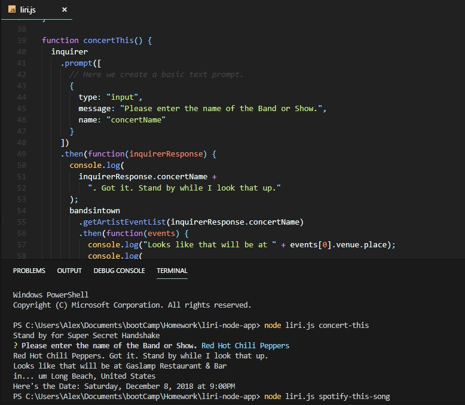
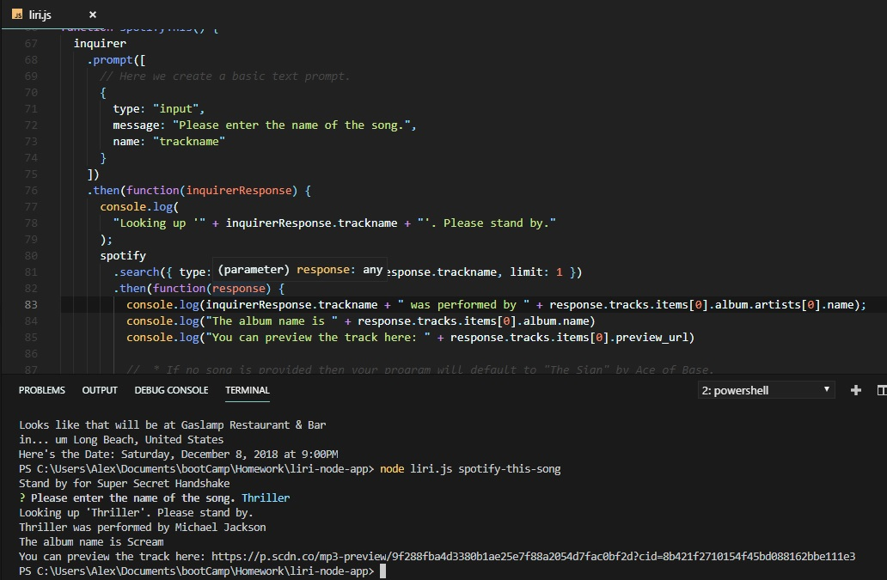
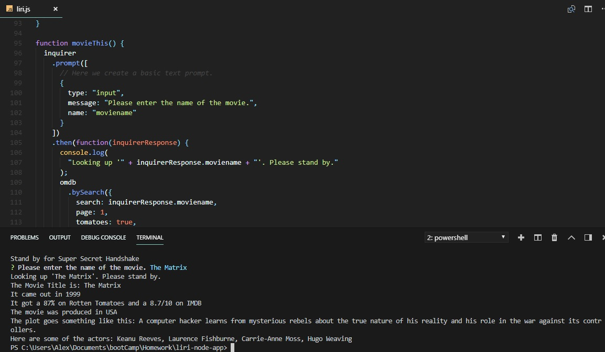
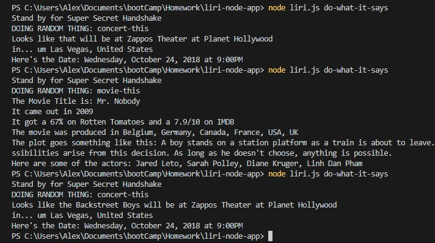

# liri-node-app

Hello and welcome to LIRI.
Much like Apple's SIRI, LIRI will interpret YOUR command line interface commands and do cool things for you while you wait!
Run down on the commands LIRI will take in for you.

This app is useful to learn the principals of using node.js to access API's, display information in the console, and record information to external files.

1. `node liri.js concert-this`
   Liri will ask you what band you are looking for!

   This will search the Bands in Town Artist Events API and tell you where and when the next event is!

      

2. `node liri.js spotify-this-song`
  Liri will ask you what song you need!

   - This will show the following information about the song in your terminal/bash window
     - Artist(s)
     - The song's name
     - A preview link of the song from Spotify
     - The album that the song is from

   

3. `node liri.js movie-this`
    Liri will ask you which movie you want to look for!

   - This will output the following information to your terminal/bash window:

     ```
       * Title of the movie.
       * Year the movie came out.
       * IMDB Rating of the movie.
       * Rotten Tomatoes Rating of the movie.
       * Country where the movie was produced.
       * Language of the movie.
       * Plot of the movie.
       * Actors in the movie.
     ```

    

4. `node liri.js do-what-it-says`
   
   Liri will select a random command with a random input and search for that thing!

    

